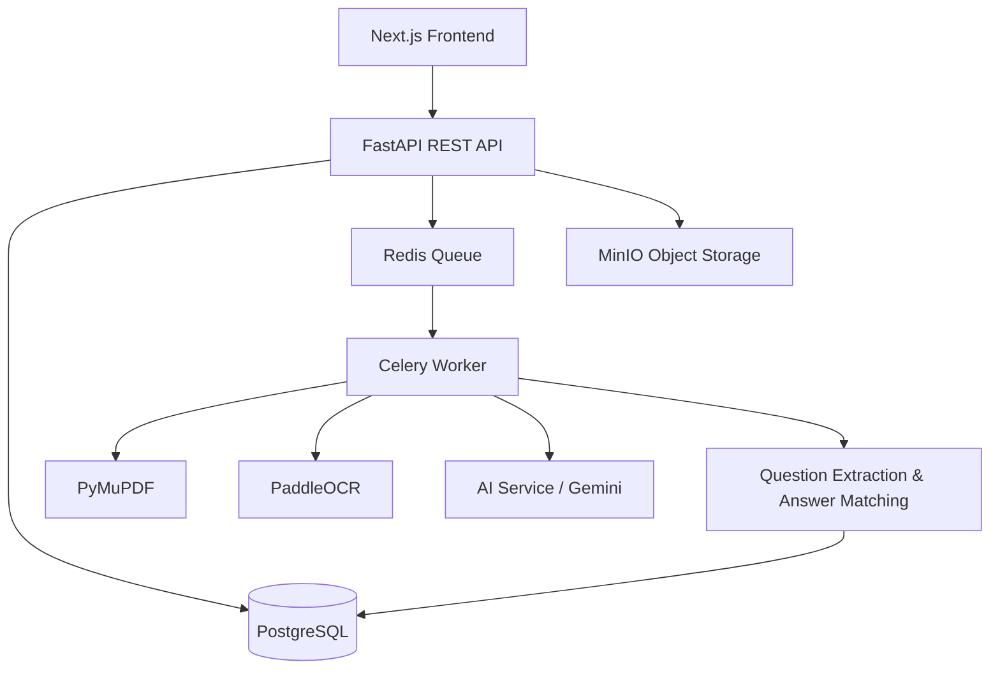

# Architecture

## Overall Architecture
The system uses a modern frontend/backend split with background processing for heavy document extraction tasks.

```mermaid
flowchart TD
    A[Next.js Frontend] --> B[FastAPI REST API]
    B --> C[(PostgreSQL)]
    B --> D[Redis Queue]
    B --> E[MinIO Object Storage]
    D --> F[Celery Worker]
    F --> G[PyMuPDF]
    F --> H[PaddleOCR]
    F --> I[AI Service / Gemini]
    F --> J[Question Extraction & Answer Matching]
    J --> C
```
